## How to setup your own harvester

The harvester works best with about 20 search-terms (called keyword here) organized below 4-6 topics.

### 1) Register at [newsapi.org](https://newsapi.org/)

* Register at [newsapi.org]([https://newsapi.org](https://newsapi.org/register) with email & password

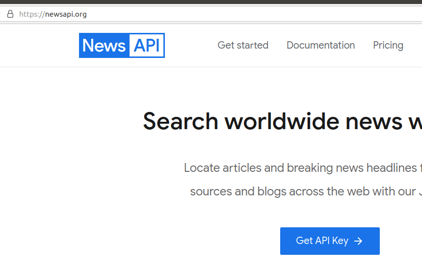

* Make sure to choose the free developer version - see [pricing](https://newsapi.org/pricing); well simply don"t enter credit card infos
 
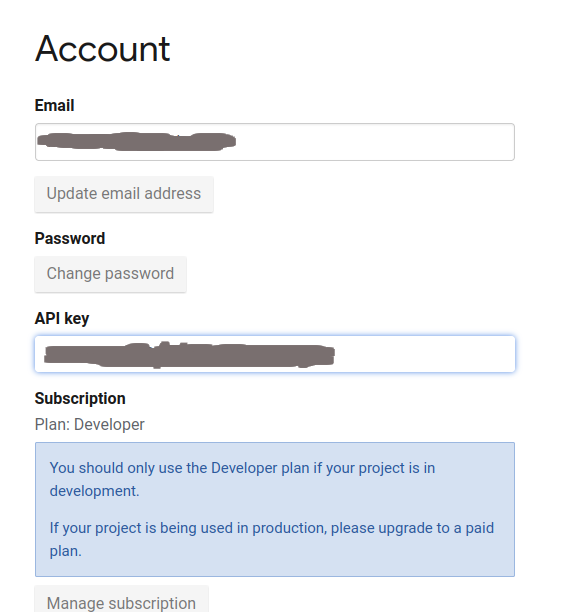

* Verify your email
* Get your API key from your [account](https://newsapi.org/account) and copy it. Should look something like '1a2b3c4d5e6f7a8b9c0d1e2f3a4b5c6d7'.

### 2) Register at [github.com]()

* Some instructions can be found [here](https://docs.github.com/en/get-started/signing-up-for-github/signing-up-for-a-new-github-account)
* Get your free [account](https://github.com/join) with username (mine is 'kmicha'), email & password
* Make sure to register for a free version; well simply don"t enter credit card infos
* Verify your email

### 3) Create an organisation at github.com

* Sign in and go to your organization page.

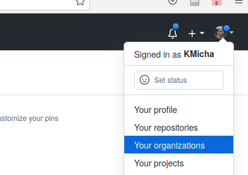

* Create a new organization with unique name - i.e. choose your username and append '-news', like 'kmicha-news'

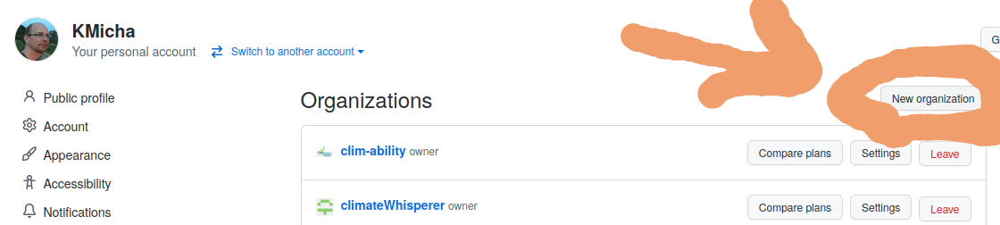

### 4) Fork the [newsWhisperer/winterIsComing](https://github.com/newsWhisperer/winterIsComing) repository to your new organization

* Goto [newsWhisperer/winterIsComing](https://github.com/newsWhisperer/winterIsComing), select 'fork' and 'Create a new fork'

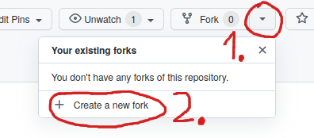

* Choose your new organisation as owner

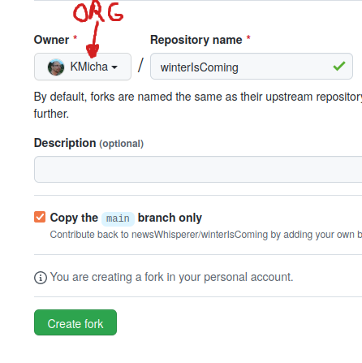

* Press the green button

### 5) Add me to repository team with write access

* Goto the settings page and select the 'Collaborators and Teams'
 
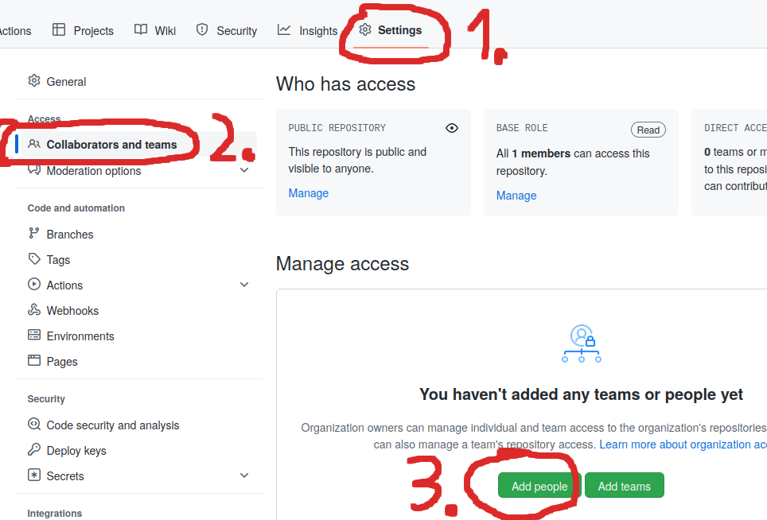 

* Add me (KMicha) with write access

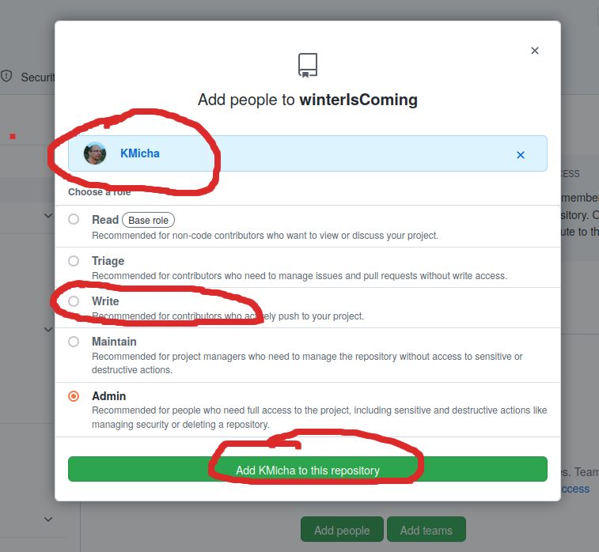
  
### 6) Adapt the keywords and topics

The harvester works best with about 20 search-terms (called keyword here) organized below 4-6 topics.

* Goto  to your code page and select the keywords.csv file

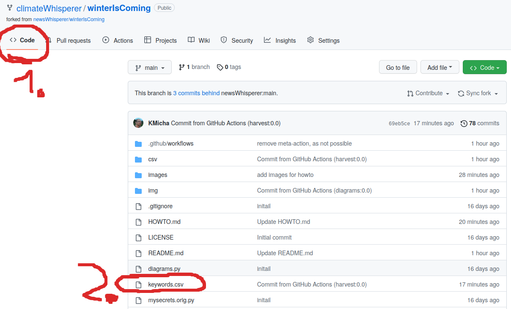

-* Edit the keywords file
  * Make sure to keep the first (header-)line unchanged
  * keyword: Your searchterm with single quotes. Can combine severall words, like 'this that'. Keywords should be unique.
  * language: Choose your language (must be supported by newsapi). i.e. de or en
  * topic: Severall keywords are combined into a common topic. No quotes. No spaces.
  * topicColor: The hexcode of the topic. Same topics, same color codes!
  * keywordColors: Ech keyword can have a seperate color hexcode. Might be similiar to it"s realted topic color.
  * limitPages: Will be dynamically adapted. Set to 1 initially
  * ratioNew: will also be adapted. 1 is also fine.

Colorpickers can be googled. Or use one of these: [redketchup](https://redketchup.io/color-picker), [w3schools](https://www.w3schools.com/colors/colors_picker.asp)
  
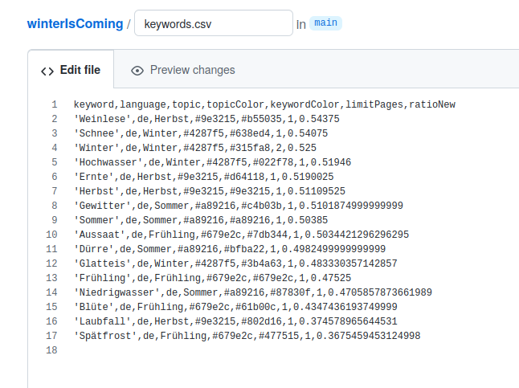
  
Attention: You can adapt the keywords later, but for now you should not remove any, once you've started harvesting!

 * Submit the changed file. Description can be empty. Commit directly to main branch. Press the green button. 

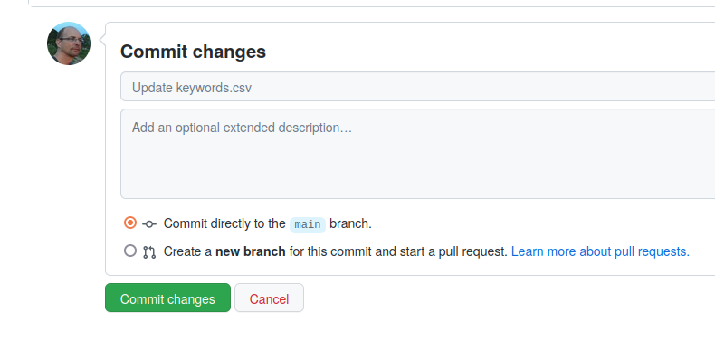

### 7. Remove existing news_20yy_mm.csv files

Inside your repository, goto code, then inside csv folder, select news_2022_mm.csv file (one after the other) and delete it.
After each deletion,a commit must be done. 

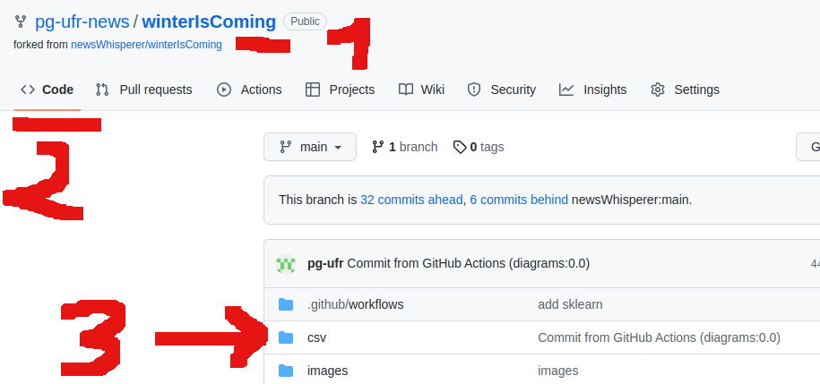

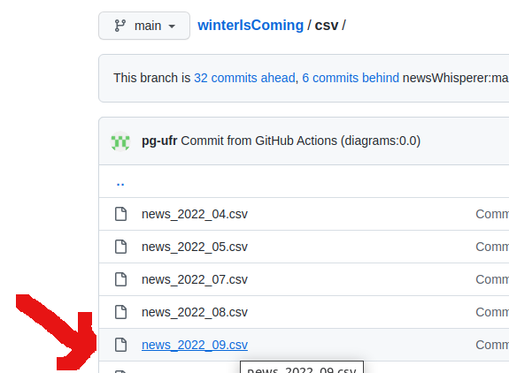

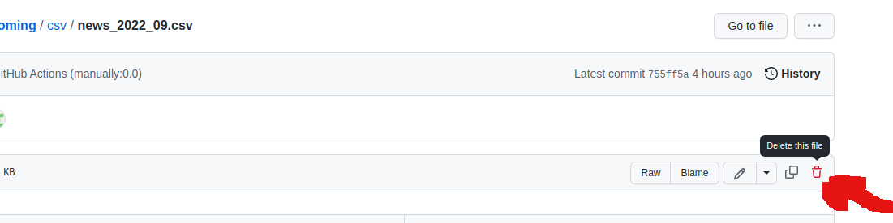

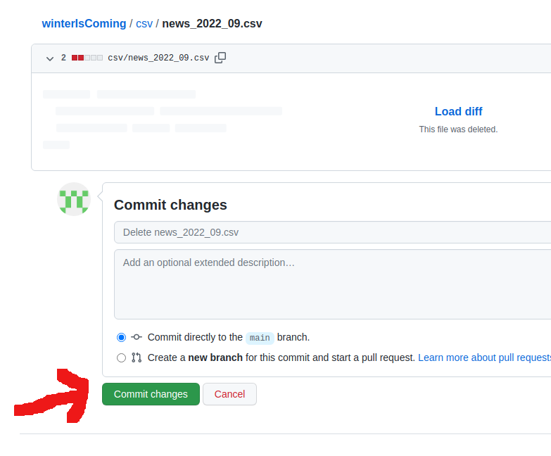

### 8.) Add the newsapi API-key to your organization

Switch to your organization (the one ending with "-news") and goto the settings tab.
Scroll down  untill you find the Security section at the left side panel; there open the Secrets-Range and click on Actions.

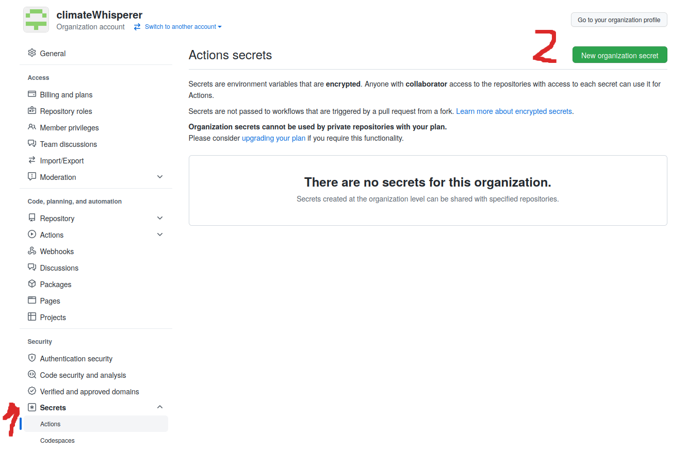

Press the "New organization secret" button and add the newsapi-key inside the Value field. For the name use "NEWSAPI_KEY".

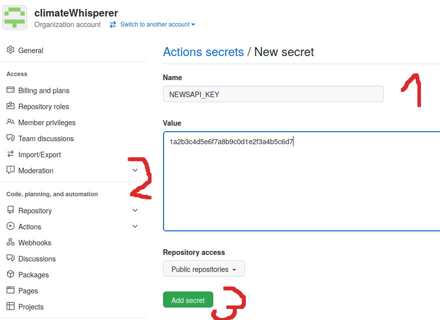
